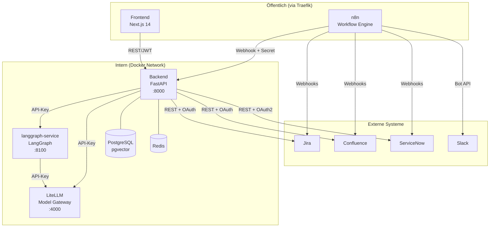
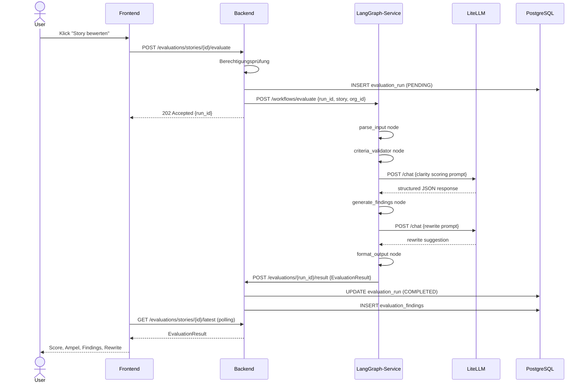
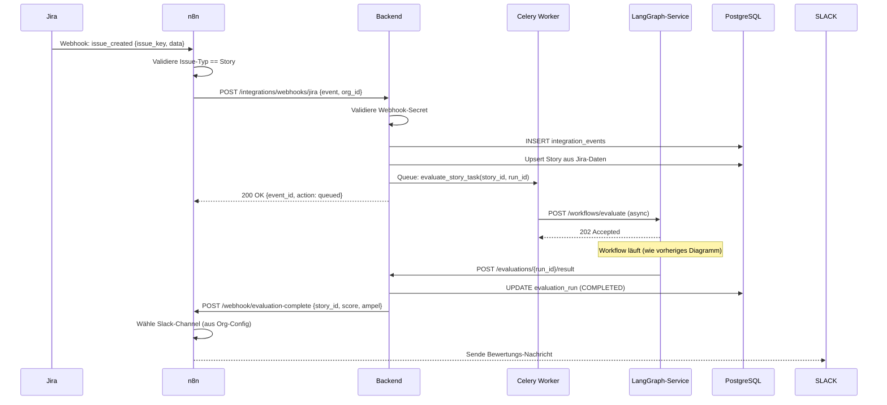
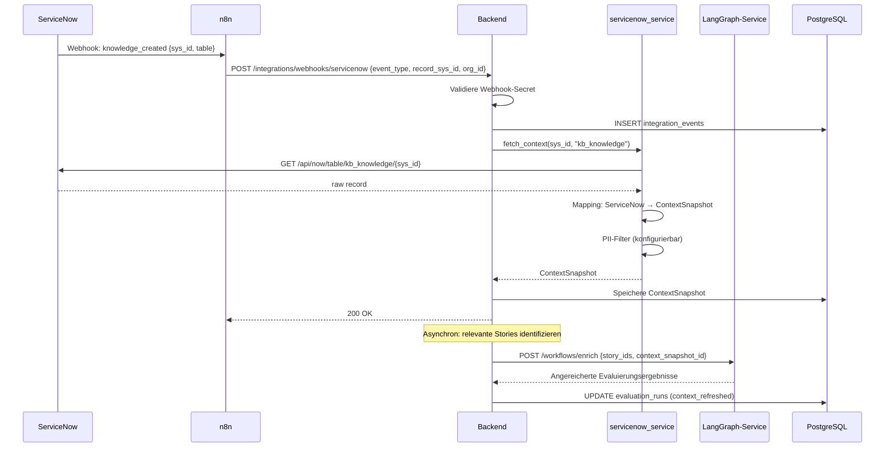
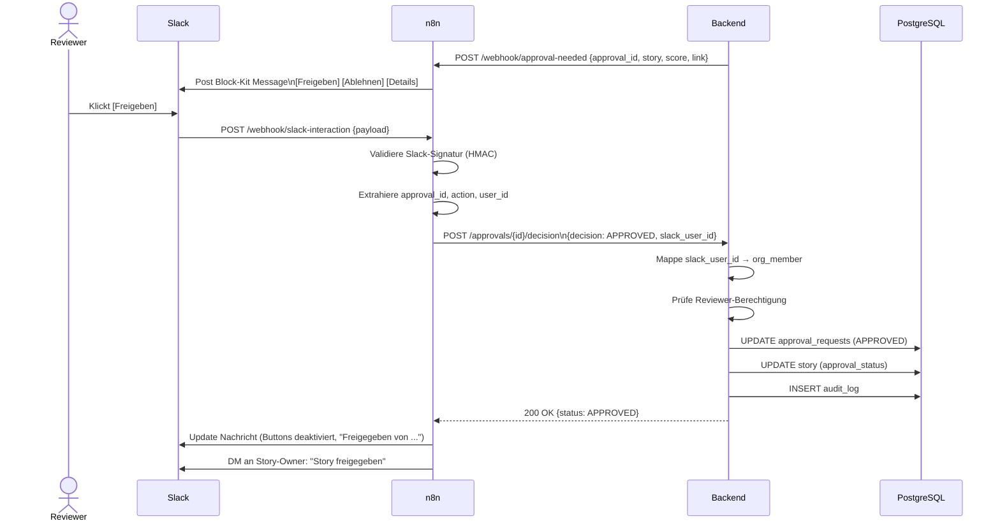

# AI Orchestration Architecture Epic — Implementation Plan

> **For agentic workers:** REQUIRED SUB-SKILL: Use superpowers:subagent-driven-development (recommended) or superpowers:executing-plans to implement this plan task-by-task. Steps use checkbox (`- [ ]`) syntax for tracking.

**Goal:** Extend the assist2 workspace with a production-ready, auditable, multi-agent AI architecture that validates, deduplicates, refines, and enriches user stories through a governed human-in-the-loop pipeline.

**Architecture:** Backend remains the system of record and governance layer. A new `langgraph-service` handles stateful multi-step AI workflows. LiteLLM (already running) is the sole model gateway. n8n handles external triggers, notifications, and Slack approval routing. UI talks only to backend.

**Tech Stack:** FastAPI (backend), LangGraph + LangChain (AI service), LiteLLM (model gateway, already deployed), pgvector (similarity search, already enabled), n8n (workflow engine), Next.js 14 (frontend), PostgreSQL 16, Redis, Slack Bolt SDK

---

## Scope Check — Recommended Sub-Plan Breakdown

This epic is too large for a single implementation session. Execute in 5 independent sub-plans:

| Sub-Plan | Content | Prerequisite |
|---|---|---|
| **A** | LangGraph Service + Backend Evaluation API | none |
| **B** | Duplicate Detection + pgvector Search | Plan A |
| **C** | n8n Trigger Workflows (Jira, ServiceNow) | Plan A |
| **D** | Slack Approval Integration | Plan A |
| **E** | UI: Score Display + Approval Flow | Plan A |

This master document is the architectural reference. Each sub-plan references it.

---

## 1. Executive Summary

assist2 hat bereits eine funktionsfähige AI-Pipeline (Complexity Scoring, Multi-Provider-Routing, RAG-Referenz) und eine betriebsbereite LiteLLM-Instanz. Der fehlende Baustein ist eine **zustandsbehaftete, auditierbare, erweiterbare Agentenschicht** — die Lücke zwischen einfachen LLM-Calls und einem enterprise-tauglichen Bewertungs- und Freigabeprozess.

Die Erweiterung fügt hinzu:
1. `langgraph-service` — neuer Python-Microservice für mehrstufige AI-Workflows
2. Strukturierte Evaluierungs-API im Backend mit vollständigem Audit Trail
3. Dubletten-Prüfung über pgvector (bereits aktiviert)
4. ServiceNow als Kontext- und Triggerquelle
5. Slack als Freigabekanal (nicht System of Record)
6. UI-Anzeige für Score, Ampel, Begründungen, Rewrite-Vorschläge

---

## 2. Epic-Beschreibung

### Name
**EPIC-AI-001: Intelligente Story-Bewertungs- und Freigabearchitektur**

### Ziel
Jede User Story und Anforderung, die in assist2 erstellt oder aus einem externen System (Jira, ServiceNow) importiert wird, kann automatisiert bewertet, auf Dubletten geprüft, mit Unternehmenskontext angereichert und durch einen nachvollziehbaren Freigabeprozess geleitet werden.

### Business-Nutzen
- Frühzeitige Erkennung unklarer oder unvollständiger Anforderungen → weniger Nacharbeit im Sprint
- Automatische Kontextanreicherung aus Jira/Confluence/ServiceNow → weniger manueller Rechercheaufwand
- Auditierbare Freigabeprozesse → Compliance-Tauglichkeit
- Modellunabhängigkeit durch LiteLLM → kein Vendor Lock-in

### Scope
- Story-Validator mit strukturiertem Score und Begründung
- Dubletten- und Ähnlichkeitsprüfung (pgvector + Jira/Confluence)
- AI-Refinement (Rewrite-Vorschlag)
- Human-in-the-loop Freigabe über Workspace-UI und Slack
- Kontextanreicherung aus Jira, Confluence, ServiceNow
- Audit Trail für alle AI-Operationen
- n8n-Trigger für Jira-Events und ServiceNow-Events
- LangGraph-Service als eigener Container

### Nicht-Ziele / Abgrenzung
- Kein vollständiger Ersatz der bestehenden AI-Pipeline (bestehende `suggest`/`docs`-Calls bleiben unverändert)
- Kein eigenständiger Deployment-Agent (Phase 3)
- Kein Compliance-Agent (Phase 3)
- Keine direkte Schreiboperation zurück nach Jira oder ServiceNow (Phase 2)
- Kein eigenes Embedding-Modell-Finetuning
- Slack ist nicht System of Record — keine Story-Daten aus Slack lesen

### Risiken
| Risiko | Wahrscheinlichkeit | Auswirkung | Maßnahme |
|---|---|---|---|
| LangGraph API-Breaks bei Updates | mittel | hoch | Version pinnen, Abstraktion über eigenes Interface |
| ServiceNow-Zugang fehlt in frühen Phasen | hoch | mittel | Mock-Adapter für Entwicklung vorsehen |
| pgvector-Performance bei großen Datensätzen | niedrig | mittel | HNSW-Index, Pagination |
| Slack-Webhook-Validierung komplex | niedrig | hoch | Signatur-Validierung von Anfang an, nie skippen |
| LLM-Output nicht deterministisch | immer | mittel | Strukturiertes Output-Schema erzwingen (JSON-Mode) |

### Annahmen
- LiteLLM läuft und ist über `http://litellm:4000` erreichbar (bestätigt aus docker-compose)
- pgvector-Extension ist aktiviert (bestätigt: `pgvector/pgvector:pg16`)
- Jira-Service im Backend existiert (bestätigt: `jira_service.py`)
- n8n ist erreichbar und kann Backend-Webhooks aufrufen
- Slack-App kann für den jeweiligen Workspace konfiguriert werden
- ServiceNow-Sandbox-Zugang ist für Phase 2 verfügbar

### Abhängigkeiten
- `langgraph-service` muss vor allen Evaluierungs-Features deployed sein
- pgvector-Embedding-Migration muss vor Dubletten-Feature laufen
- Slack-App-Konfiguration (Bot Token, Signing Secret) muss vor Slack-Feature bereitstehen
- ServiceNow-OAuth-Credentials für Phase 2

---

## 3. Zielarchitektur

```
┌─────────────────────────────────────────────────────────────────────┐
│                         INTERNET / CLIENTS                          │
└────────────────────────────┬────────────────────────────────────────┘
                             │ HTTPS
                    ┌────────▼────────┐
                    │    Traefik v3   │  TLS-Termination, Auth-Middleware
                    └────────┬────────┘
              ┌──────────────┼──────────────┐
              │              │              │
     ┌────────▼───┐  ┌───────▼──────┐  ┌───▼─────┐
     │  frontend  │  │   backend    │  │   n8n   │
     │ Next.js 14 │  │   FastAPI    │  │         │
     │   :3000    │  │    :8000     │  │  :5678  │
     └────────────┘  └──────┬───────┘  └────┬────┘
                            │               │
            ┌───────────────┼───────────────┼──────────────┐
            │               │               │              │
   ┌────────▼───┐  ┌────────▼──────┐  ┌────▼─────┐  ┌────▼────────┐
   │  postgres  │  │langgraph-svc  │  │ litellm  │  │    redis    │
   │  pgvector  │  │  (new)  :8100 │  │  :4000   │  │   :6379     │
   └────────────┘  └───────────────┘  └──────────┘  └─────────────┘
                                                           │
                          ┌────────────────────────────────┤
                          │         EXTERNE SYSTEME        │
                    ┌─────▼────┐  ┌──────────┐  ┌─────────▼──┐  ┌──────┐
                    │   Jira   │  │Confluence│  │ServiceNow  │  │Slack │
                    └──────────┘  └──────────┘  └────────────┘  └──────┘
```

### Verantwortlichkeiten pro Komponente

| Komponente | Verantwortung | System of Record für |
|---|---|---|
| **frontend** | Darstellung, User-Interaktion, kein direkter LLM-Call | — |
| **backend** | Fachlogik, Governance, Permissions, Audit, API-Kontrakte | Stories, Evaluierungen, Freigaben, Org-Daten |
| **langgraph-service** | Stateful AI-Workflows, mehrstufige Agenten, Evaluierungs-Logik | Workflow-State (ephemeral, nicht persistent) |
| **litellm** | Modell-Gateway, Load-Balancing, Provider-Abstraktion | — |
| **n8n** | Externe Trigger, Benachrichtigungen, Slack-Routing, lineare Prozesse | — |
| **postgres** | Persistenz aller fachlichen und Audit-Daten | Alles Persistente |
| **redis** | Sessions, JWT-Blacklist, Celery-Queue, Pub/Sub, n8n-Cache | — |
| **Jira** | Externe Issue-Verwaltung | externe Issues |
| **Confluence** | Wissensquelle | externe Docs |
| **ServiceNow** | Requests, Incidents, CMDB-Kontext | externe ITSM-Daten |
| **Slack** | Benachrichtigungen, Freigabe-Interaktionen | **nichts** |

### Warum diese Aufteilung

1. **Backend als System of Record:** Jede Freigabe, jede Bewertung, jeder AI-Output wird im Backend gespeichert, bevor eine externe Benachrichtigung gesendet wird. Slack-Klicks und n8n-Events sind nur Eingaben — sie schreiben nie direkt in die DB.

2. **LangGraph getrennt vom Backend:** LangGraph-Workflows können Minuten laufen, haben eigenen State und benötigen Python-spezifische Dependencies (langgraph, langchain). Im Backend würde das die FastAPI-Request-Lifecycle verletzen und Deployments verkomplizieren. Separation erlaubt unabhängiges Scaling und Deployment.

3. **n8n nicht als Agenten-Gehirn:** n8n kann keine semantisch-zustandsbehafteten Entscheidungsschleifen abbilden. Es eignet sich für: "Warte auf Jira-Event → rufe Backend-Webhook auf → sende Slack-Nachricht". Nicht für: "Analysiere Story → entscheide ob mehr Kontext nötig → hole Kontext → bewerte erneut".

4. **LiteLLM als einziger Modell-Zugang:** Verhindert, dass Model-Credentials an mehreren Stellen im Code verstreut sind. Erlaubt Modellwechsel ohne Code-Deployment. Ermöglicht Observability aller LLM-Calls an einer Stelle.

---

## 4. Architekturentscheidungen

### ADR-001: UI spricht ausschließlich mit Backend
**Entscheidung:** Das Frontend ruft niemals LiteLLM, LangGraph-Service oder externe Systeme direkt auf.
**Begründung:** Direkter Zugriff würde Auth-Tokens im Browser exponieren, Audit-Trail zerstören, und Mandantentrennung unmöglich machen. Das Backend ist der einzige Trust-Boundary-Punkt.

### ADR-002: LangGraph als eigener Microservice
**Entscheidung:** `langgraph-service` ist ein eigenständiger FastAPI+LangGraph Python-Container, erreichbar über `http://langgraph-service:8100`.
**Begründung:** LangGraph-Workflows sind long-running (potenziell Minuten), require eigene Python-Dependencies, und sollen unabhängig skalierbar sein. Das Backend ruft den Service async über HTTP auf und speichert das Ergebnis — der Workflow-State ist flüchtig im LangGraph-Service.
**Konsequenz:** Backend hält `evaluation_run_id` und Status — LangGraph-Service ist zustandslos aus Persistenz-Sicht (State nur während Workflow-Laufzeit).

### ADR-003: Geschäftsregeln nicht in Prompts
**Entscheidung:** Akzeptanzkriterien-Validierung, Pflichtfelder-Prüfung, Rollen-Berechtigungen und Freigabe-Policies liegen im Backend — nicht in System-Prompts.
**Begründung:** Prompts sind nicht versionierbar, nicht testbar als Code, nicht auditierbar und können durch adversarielle Inputs umgangen werden. Eine User darf nicht durch Prompt-Manipulation eine Freigabe erzwingen.

### ADR-004: pgvector für Similarity Search
**Entscheidung:** Kein separater Vektordatenbank-Container. pgvector ist bereits aktiviert — Embeddings werden in `story_embeddings`-Tabelle gespeichert.
**Begründung:** Weniger Infrastruktur-Komplexität für MVP. pgvector mit HNSW-Index ist für Tausende bis low-millions Vektoren ausreichend. Migration zu Qdrant/Weaviate ist später möglich.

### ADR-005: Slack ist kein System of Record
**Entscheidung:** Slack-Block-Kit-Aktionen (Approve/Reject-Buttons) senden Callbacks an Backend via n8n. Das Backend speichert die Entscheidung und gibt n8n nur einen Bestätigungs-Status zurück.
**Begründung:** Slack-Nachrichten können gelöscht werden, Slack-History ist nicht revisionssicher, Slack-API-Fehler dürfen keinen Datenverlust verursachen.

### ADR-006: ServiceNow nur als Kontextquelle (Phase 1/2)
**Entscheidung:** ServiceNow-Integration liest Daten (Knowledge Base, CMDB, Incidents) für Kontextanreicherung. Keine Schreiboperationen zurück nach ServiceNow in Phase 1.
**Begründung:** Write-back erfordert ServiceNow-Approval-Workflows auf der anderen Seite — zu komplex für MVP. Mapping-Logik wird im Backend-Service gekapselt, nicht in n8n-Workflows.

### ADR-007: Embedding-Modell über LiteLLM
**Entscheidung:** Story-Embeddings werden über LiteLLM mit einem konfigurierten Embedding-Modell erzeugt (z.B. `text-embedding-3-small`), nicht direkt über OpenAI SDK.
**Begründung:** Zentrale Observability, austauschbares Modell, einheitliche Credentials.

---

## 5. Komponentenmodell

### 5.1 `langgraph-service` (neu)

```
Name:         langgraph-service
Port:         8100 (intern, kein öffentlicher Zugang)
Image:        assist2-langgraph (eigenes Dockerfile)
Hauptzweck:   Stateful AI-Workflows für Story-Evaluation, Refinement, Duplikat-Prüfung
```

**Schnittstellen (HTTP):**
- `POST /workflows/evaluate` — startet Story-Evaluierungs-Workflow
- `POST /workflows/refine` — startet Refinement-Workflow
- `POST /workflows/check-duplicates` — startet Ähnlichkeitsprüfung
- `GET /workflows/{run_id}/status` — Workflow-Status abfragen
- `GET /health` — Health Check

**Persistenzbedarf:** keiner — State ist flüchtig (LangGraph InMemoryCheckpointer für MVP, später Redis-Checkpointer)
**Sicherheitsrelevanz:** Nur über internes Docker-Netz erreichbar. Backend authentifiziert via shared secret (`LANGGRAPH_API_KEY` in `.env`).
**Betriebsrelevanz:** Eigenes Log-Format mit `workflow_id`, `story_id`, `org_id`. Timeout-Handling kritisch.

**Interne Struktur:**
```
langgraph-service/
  app/
    main.py                    # FastAPI entrypoint
    config.py                  # Settings (litellm url, api key, timeout)
    workflows/
      evaluate.py              # Story-Evaluierungs-Graph
      refine.py                # Refinement-Graph
      duplicate_check.py       # Ähnlichkeitsprüfungs-Graph
    nodes/                     # einzelne Graph-Nodes
      story_parser.py          # strukturierter Input-Parse
      criteria_validator.py    # AC-Vollständigkeit prüfen
      clarity_scorer.py        # Klarheits-Score
      context_fetcher.py       # Kontext aus Backend holen
      rewrite_generator.py     # Rewrite-Vorschlag generieren
      duplicate_detector.py    # Embedding-Vergleich
    schemas/
      evaluation.py            # Input/Output Pydantic-Schemas
      refinement.py
    llm/
      client.py                # LiteLLM-Wrapper (alle LLM-Calls laufen hier durch)
  Dockerfile
  requirements.txt
```

### 5.2 Backend-Erweiterungen

**Neue Tabellen:**
- `evaluation_runs` — Persistenz aller AI-Bewertungsläufe
- `evaluation_findings` — Einzelbefunde pro Evaluierung
- `approval_requests` — Freigabeanfragen mit Status
- `story_embeddings` — pgvector Embedding-Vektoren
- `integration_events` — eingehende Events von Jira/ServiceNow für Audit

**Neue Services:**
- `backend/app/services/evaluation_service.py` — orchestriert LangGraph-Aufrufe, speichert Ergebnisse
- `backend/app/services/approval_service.py` — Freigabe-Lifecycle
- `backend/app/services/embedding_service.py` — Embedding-Generierung und -Abfrage
- `backend/app/services/servicenow_service.py` — ServiceNow-Client

**Neue Routers:**
- `backend/app/routers/evaluations.py` — `/api/v1/evaluations/*`
- `backend/app/routers/approvals.py` — `/api/v1/approvals/*`
- `backend/app/routers/slack_callbacks.py` — `/api/v1/slack/callback`
- `backend/app/routers/integration_webhooks.py` — `/api/v1/integrations/webhooks/*`

**Neue Migrations:**
- `migrations/versions/xxxx_add_evaluation_tables.py`
- `migrations/versions/xxxx_add_story_embeddings.py`

### 5.3 n8n Workflows (neu/erweitert)

- `workflows/jira-story-trigger.json` — Jira-Webhook → Backend-Evaluate
- `workflows/servicenow-context-trigger.json` — ServiceNow-Webhook → Backend-Enrich
- `workflows/slack-approval-router.json` — Slack-Callback → Backend-Approval-Decision
- `workflows/evaluation-notification.json` — Backend-Event → Slack/Mail-Benachrichtigung

---

## 6. Datenflüsse / Sequenzen

### Flow 1: Story-Bewertung aus der UI

```
Trigger: User klickt "Story bewerten" in Workspace-UI

1. UI          → POST /api/v1/evaluations/stories/{story_id}/evaluate
2. Backend     → Berechtigungsprüfung (org_id, user role)
3. Backend     → Erstelle evaluation_run (status=PENDING) in DB
4. Backend     → POST http://langgraph-service:8100/workflows/evaluate
                  {story_id, story_content, org_id, run_id, context_sources}
5. LG-Service  → Node: story_parser (strukturierter Input)
6. LG-Service  → Node: criteria_validator (AC-Vollständigkeit)
7. LG-Service  → Node: clarity_scorer (LiteLLM-Call: Klarheitsbewertung)
8. LG-Service  → Node: context_fetcher (GET /api/v1/context/stories/{id})
9. LG-Service  → Node: duplicate_detector (pgvector similarity query)
10. LG-Service → Node: rewrite_generator (LiteLLM-Call: Rewrite)
11. LG-Service → POST http://backend:8000/api/v1/evaluations/{run_id}/result
12. Backend    → UPDATE evaluation_run (status=COMPLETED, result=JSON)
13. Backend    → INSERT evaluation_findings (pro Finding)
14. Backend    → 200 OK {run_id, status, result} an UI
15. UI         → Zeige Score, Ampel, Findings, Rewrite-Vorschlag

Fehlerpfad (LG-Service Timeout):
4b. Backend    → evaluation_run (status=FAILED, error=TIMEOUT)
14b. Backend   → 202 Accepted {run_id, status=PENDING} (async fallback)

Auditpunkte: Schritt 3 (run created), Schritt 12 (run completed), Schritt 13 (findings)
```

### Flow 2: Jira-Event → Automatische Bewertung

```
Trigger: Jira-Webhook auf n8n (neues Issue oder Issue-Update)

1. Jira        → POST n8n webhook /webhook/jira-story
2. n8n         → Validiere Payload (issue type == Story?)
3. n8n         → POST http://backend:8000/api/v1/integrations/webhooks/jira
                  {event_type, issue_key, issue_data, org_id (aus n8n-Config)}
4. Backend     → Validiere Webhook-Signatur und org_id
5. Backend     → INSERT integration_events (für Audit)
6. Backend     → Story bereits vorhanden? Wenn nein: optional importieren
7. Backend     → POST http://langgraph-service:8100/workflows/evaluate (async via Celery)
8. Celery      → [async] führt Workflow aus (wie Flow 1, Schritte 5-13)
9. Celery      → POST n8n /webhook/evaluation-complete {story_id, run_id, score, ampel}
10. n8n        → Sende Slack-Nachricht an konfigurierten Channel
                  "Story [KEY] bewertet: Score 6.2/10, Ampel: GELB — Details: [Link]"

Fehlerpfad (Backend nicht erreichbar):
3b. n8n        → Retry 3x mit exponential backoff, dann Dead-Letter-Queue

Auditpunkte: Schritt 5 (event received), Schritt 8 (evaluation completed)
```

### Flow 3: ServiceNow → Kontextanreicherung

```
Trigger: ServiceNow-Webhook auf n8n (neues RFC oder Knowledge-Article)

1. ServiceNow  → POST n8n webhook /webhook/servicenow
2. n8n         → Validiere Payload-Typ (Change, Knowledge, Incident)
3. n8n         → POST http://backend:8000/api/v1/integrations/webhooks/servicenow
4. Backend     → servicenow_service.fetch_context(record_id, record_type)
5. Backend     → Strukturiere ServiceNow-Daten (Mapping-Layer im Service)
6. Backend     → Speichere Context-Snapshot in `integration_events`
7. Backend     → Markiere relevante Stories für Re-Evaluierung (optional, Phase 2)
8. Backend     → 200 OK

Wichtig: ServiceNow-Daten werden niemals unverändert in Stories geschrieben.
         Der Mapping-Layer im servicenow_service normalisiert auf interne Schemas.
```

### Flow 4: Human-in-the-Loop Freigabe (Slack + Workspace)

```
Trigger: evaluation_run mit score < Threshold oder knockout=true

1. Backend     → Erkenne Freigabebedarf (policy-basiert, nicht Prompt-basiert)
2. Backend     → INSERT approval_requests (story_id, run_id, status=PENDING, reviewer=assigned_user)
3. Backend     → POST n8n /webhook/approval-needed
                  {approval_id, story_id, score, findings, workspace_link}
4. n8n         → Sende Slack Block-Kit-Nachricht mit Buttons [Freigeben] [Ablehnen] [Details]
5. Reviewer    → Klickt Button in Slack
6. Slack       → POST n8n /webhook/slack-interaction {payload: {action, approval_id, user}}
7. n8n         → Validiere Slack-Signatur
8. n8n         → POST http://backend:8000/api/v1/approvals/{id}/decision
                  {decision: APPROVED|REJECTED, slack_user_id, comment}
9. Backend     → Validiere: Ist slack_user_id ein berechtigter Reviewer für diese org?
10. Backend    → UPDATE approval_requests (status=APPROVED/REJECTED, decided_by, decided_at)
11. Backend    → UPDATE story (approval_status)
12. Backend    → INSERT audit_log (approval decision)
13. Backend    → 200 OK an n8n
14. n8n        → Update Slack-Nachricht (Button deaktiviert, Status anzeigen)
15. n8n        → Benachrichtige Story-Owner per DM

Alternativpfad (Freigabe über Workspace-UI):
5b. Reviewer   → Öffnet Approval-Page in Workspace
6b. UI         → POST /api/v1/approvals/{id}/decision (direkt ans Backend)
7b-12b: identisch ab Schritt 9

Fehlerpfad (Reviewer nicht in Workspace):
9b. Backend    → 403 Forbidden {error: "Reviewer not authorized"}
13b. n8n       → Slack: "Freigabe fehlgeschlagen — Benutzer nicht berechtigt"

Auditpunkte: Schritt 2 (approval created), Schritt 10 (decision), Schritt 12 (audit log)
```

### Flow 5: Dubletten-Prüfung

```
Trigger: Manuell aus UI oder automatisch bei neuer Story

1. Backend     → POST /api/v1/evaluations/stories/{id}/check-duplicates
2. Backend     → embedding_service.get_or_create_embedding(story_id)
3. EmbSvc      → LiteLLM: POST /embeddings {input: story_text, model: text-embedding-3-small}
4. EmbSvc      → pgvector: SELECT story_id, 1 - (embedding <=> $query_vec) AS similarity
                           FROM story_embeddings WHERE org_id=$org_id
                           ORDER BY similarity DESC LIMIT 10
5. Backend     → Für Treffer mit similarity > 0.85: Jira-Service anfragen (externe Bestätigung)
6. Backend     → POST http://langgraph-service:8100/workflows/check-duplicates
                  {story_id, candidate_ids, external_results}
7. LG-Service  → Node: semantic_comparator (LiteLLM-Call: "Sind diese Stories inhaltlich gleich?")
8. LG-Service  → Strukturiertes Ergebnis: [{candidate_id, similarity_score, explanation, is_duplicate}]
9. Backend     → Speichere Ergebnis in evaluation_run (type=DUPLICATE_CHECK)
10. Backend    → 200 OK {duplicates: [...], similar: [...]}
```

---

## 7. User Stories

### Block A: Architektur & Plattform

**A-01: LangGraph-Service bereitstellen**
Als Plattform-Entwickler möchte ich, dass `langgraph-service` als eigenständiger Docker-Container läuft, damit AI-Workflows unabhängig vom Backend deployt und skaliert werden können.
- AC: Container startet mit `docker compose up langgraph-service`
- AC: `/health` gibt `{status: ok}` zurück
- AC: Service ist nur über internes Docker-Netz erreichbar (kein Traefik-Routing)
- AC: API-Key-Authentifizierung gegenüber Backend funktioniert
- Technisch: Dockerfile, `requirements.txt` mit pinned versions, eigenes Log-Format

**A-02: LangGraph-Service Basis-Workflow**
Als Entwickler möchte ich einen ausführbaren LangGraph-Graph mit mindestens zwei Nodes, damit ich die Workflow-Infrastruktur validieren kann.
- AC: `POST /workflows/evaluate` startet Graph und gibt `run_id` zurück
- AC: Workflow schreibt Result über Callback an Backend
- AC: Timeout nach 120s mit FAILED-Status

### Block B: Backend API

**B-01: Evaluation-Run persistieren**
Als Backend möchte ich `evaluation_runs` und `evaluation_findings` in der DB speichern, damit jede AI-Bewertung vollständig auditierbar ist.
- AC: Migration erzeugt Tabellen mit korrekten Indizes
- AC: `evaluation_runs` hat `org_id`, `story_id`, `run_id`, `status`, `result`, `created_at`, `completed_at`
- AC: Soft-Delete, kein Hard-Delete für Audit-Zwecke
- Technisch: Alembic-Migration, SQLAlchemy-Models, `evaluation_service.py`

**B-02: POST /api/v1/evaluations/stories/{id}/evaluate**
Als UI-Nutzer möchte ich eine Story bewerten lassen, damit ich strukturiertes Feedback erhalte.
- AC: Nur Mitglieder der Organization können Stories dieser Org bewerten
- AC: Response enthält `run_id`, `status`, `result` (wenn synchron fertig) oder `{run_id, status: PENDING}` (async)
- AC: Fehlerfall LangGraph nicht erreichbar → 503, run_id gespeichert mit status=FAILED
- Technisch: Berechtigung über `permission_service`, LangGraph-Aufruf über `evaluation_service`

**B-03: GET /api/v1/evaluations/stories/{id}/latest**
Als UI möchte ich das neueste Evaluierungsergebnis einer Story abrufen.
- AC: Gibt `null` zurück wenn noch keine Evaluierung
- AC: Gibt vollständiges EvaluationResult-Schema zurück
- AC: Kein Cross-Org-Zugriff möglich

**B-04: POST /api/v1/approvals/{id}/decision**
Als Reviewer möchte ich eine Freigabeentscheidung treffen.
- AC: Nur zugewiesener Reviewer oder Org-Admin kann entscheiden
- AC: Entscheidung ist irreversibel (kein nachträgliches Ändern)
- AC: Audit-Log-Eintrag wird automatisch erstellt
- AC: Slack-User-ID wird gegen Org-Member-Liste validiert

**B-05: POST /api/v1/integrations/webhooks/jira**
Als n8n möchte ich Jira-Events ans Backend weiterleiten.
- AC: Webhook-Secret-Validierung (HMAC)
- AC: Idempotenz: gleiches Event zweimal → zweites wird ignoriert (event deduplication via event_id)
- AC: integration_events wird immer geschrieben (auch bei Fehler)

**B-06: Story Embedding generieren und speichern**
Als Backend möchte ich, dass bei jeder Story-Erstellung/Update ein Embedding über LiteLLM generiert und in pgvector gespeichert wird.
- AC: Embedding wird via Celery-Task asynchron generiert (kein sync auf Request-Path)
- AC: `story_embeddings` Tabelle mit HNSW-Index
- AC: Re-Embedding bei Story-Content-Update

### Block C: LangGraph Service

**C-01: Story-Evaluierungs-Graph**
Als LangGraph-Service möchte ich einen mehrstufigen Bewertungs-Graphen, der Klarheit, Vollständigkeit und Risiko einer Story bewertet.
- Nodes: `parse_input` → `validate_criteria` → `score_clarity` → `fetch_context` → `generate_findings` → `generate_rewrite` → `format_output`
- AC: Jeder Node hat definierten Input/Output-Typ (Pydantic)
- AC: LLM-Calls gehen ausschließlich über `llm/client.py` → LiteLLM
- AC: Strukturiertes JSON-Output-Schema wird per Tool-Use/JSON-Mode erzwungen

**C-02: Duplicate-Check-Graph**
Als LangGraph-Service möchte ich semantische Duplikaterkennung.
- Nodes: `embed_story` → `vector_search` → `semantic_compare` → `format_results`
- AC: Verwendet Embedding aus Backend (nicht neu generieren)
- AC: Gibt Similarity-Score + Begründung pro Kandidat zurück

### Block D: LiteLLM Integration

**D-01: LiteLLM-Konfiguration für Evaluierungs-Modelle**
Als Plattform möchte ich dedizierte Modell-Aliases für Evaluierung in `litellm_config.yaml`.
- AC: `eval-fast` → haiku (für einfache Kriterienprüfung)
- AC: `eval-quality` → sonnet (für Bewertung und Rewrite)
- AC: `embed-default` → text-embedding-3-small
- AC: Rate-Limiting und Budget-Limits konfiguriert
- AC: Fallback-Routing konfiguriert (Sonnet → Opus wenn Sonnet überlastet)

### Block E: n8n Workflows

**E-01: Jira-Story-Trigger-Workflow**
Als n8n möchte ich auf Jira-Issue-Events reagieren und automatische Bewertungen auslösen.
- AC: Webhook-Empfang, Validierung Issue-Typ (nur Story/Epic), Weiterleitung ans Backend
- AC: Fehlerbehandlung mit Retry-Logik (3x, exp. backoff)
- AC: Dead-Letter-Logging bei dauerhaftem Fehler

**E-02: Slack-Approval-Routing-Workflow**
Als n8n möchte ich Slack-Block-Kit-Callbacks empfangen und ans Backend weiterleiten.
- AC: Slack-Request-Signatur wird validiert (kein Bypass möglich)
- AC: approval_id wird aus Slack-Payload extrahiert und übergeben
- AC: n8n updatet Slack-Nachricht nach Backend-Response

**E-03: Evaluation-Notification-Workflow**
Als n8n möchte ich bei abgeschlossenen Evaluierungen Benachrichtigungen versenden.
- AC: Slack-Nachricht mit Score, Ampel, Link zur Story
- AC: Bei Score < Threshold → zusätzlich Freigabe-Anfrage-Nachricht mit Buttons

### Block F: UI

**F-01: Evaluation Score Panel**
Als User möchte ich das Bewertungsergebnis einer Story übersichtlich sehen.
- AC: Ampel (Rot/Gelb/Grün), Score (0-10), Confidence
- AC: Aufklappbare Findings-Liste mit Schweregrad
- AC: Rewrite-Vorschlag mit "Übernehmen"-Button
- AC: "Jetzt bewerten"-Button startet neue Evaluierung

**F-02: Approval-Status in Story-Ansicht**
Als User möchte ich den Freigabe-Status einer Story sehen.
- AC: Pending/Approved/Rejected mit Datum und Reviewer
- AC: Reviewer sieht Approve/Reject-Buttons direkt in UI

### Block G: Audit & Logging

**G-01: Audit-Trail für alle AI-Operationen**
Als Compliance-relevante Funktion müssen alle AI-Aufrufe nachvollziehbar gespeichert sein.
- AC: `evaluation_runs` enthält: model_used, input_token_count, output_token_count, provider, latency_ms
- AC: Kein Hard-Delete möglich (soft-delete only)
- AC: Export als JSON via `/api/v1/audit/evaluations` (Admin only)

### Block H: Search / Similarity

**H-01: pgvector HNSW-Index für Story-Embeddings**
Als Backend möchte ich performante Similarity-Suche über tausende Stories.
- AC: HNSW-Index mit `lists=100` für org_id-partitionierte Suche
- AC: Query-Time < 200ms für 10k Vektoren
- AC: Migration mit CONCURRENTLY um Prod-Outage zu vermeiden

### Block I: ServiceNow Integration

**I-01: ServiceNow-Service im Backend**
Als Backend möchte ich ServiceNow-Daten (Knowledge, CMDB, Changes) strukturiert abrufen.
- AC: OAuth2-Auth gegenüber ServiceNow
- AC: Mapping-Layer: ServiceNow-Felder → internes Context-Schema
- AC: Timeout und Fehlerbehandlung (ServiceNow-Ausfall darf keine Story-Bewertung blockieren)
- AC: Ergebnisse werden gecacht (Redis, 15min TTL)

### Block J: Security

**J-01: Mandantentrennung für Evaluierungen**
Als Multi-Tenant-Plattform muss jede Evaluierung an eine `org_id` gebunden sein.
- AC: Kein Cross-Org-Zugriff auf evaluation_runs möglich
- AC: LangGraph-Service erhält `org_id` und gibt sie in allen Callbacks zurück
- AC: pgvector-Queries filtern immer nach `org_id`

---

## 8. Technische Tasks / Work Packages

### Phase 0: Foundation (Prerequisite für alles)

- [ ] **T-001** `langgraph-service` Dockerfile + `docker-compose.yml` Eintrag
- [ ] **T-002** `langgraph-service` FastAPI-Skeleton + Health-Endpoint
- [ ] **T-003** Alembic-Migration: `evaluation_runs`, `evaluation_findings`, `approval_requests`
- [ ] **T-004** Alembic-Migration: `story_embeddings` mit pgvector-Column und HNSW-Index
- [ ] **T-005** Alembic-Migration: `integration_events`
- [ ] **T-006** `evaluation_service.py` Skeleton mit LangGraph-HTTP-Client
- [ ] **T-007** LiteLLM-Config: Aliases `eval-fast`, `eval-quality`, `embed-default`

### Phase 1: MVP Story-Validator

- [ ] **T-010** LangGraph: `story_parser` Node (strukturierter Input-Parse)
- [ ] **T-011** LangGraph: `criteria_validator` Node (AC-Vollständigkeit, deterministisch)
- [ ] **T-012** LangGraph: `clarity_scorer` Node (LiteLLM-Call, JSON-Mode)
- [ ] **T-013** LangGraph: `generate_findings` Node (strukturierter Output)
- [ ] **T-014** LangGraph: `rewrite_generator` Node (LiteLLM-Call)
- [ ] **T-015** LangGraph: `format_output` Node → EvaluationResult-Schema
- [ ] **T-016** LangGraph: Callback-Client (POST result ans Backend)
- [ ] **T-017** Backend: `POST /api/v1/evaluations/stories/{id}/evaluate`
- [ ] **T-018** Backend: `GET /api/v1/evaluations/stories/{id}/latest`
- [ ] **T-019** Backend: `POST /api/v1/evaluations/{run_id}/result` (intern, LangGraph-Callback)
- [ ] **T-020** UI: EvaluationPanel-Komponente (Score, Ampel, Findings)
- [ ] **T-021** UI: Rewrite-Vorschlag mit "Übernehmen"-Button

### Phase 1: MVP Embedding + Duplicate Check

- [ ] **T-030** `embedding_service.py`: LiteLLM-Embedding-Call + pgvector-Store
- [ ] **T-031** Celery-Task: Embedding bei Story-Create/Update
- [ ] **T-032** LangGraph: `duplicate_check` Workflow
- [ ] **T-033** Backend: `POST /api/v1/evaluations/stories/{id}/check-duplicates`
- [ ] **T-034** UI: Duplicate-Results anzeigen

### Phase 1: MVP Slack Notification

- [ ] **T-040** n8n-Workflow: `evaluation-notification.json` (Score → Slack)
- [ ] **T-041** n8n-Webhook-Endpunkt im Backend registrieren
- [ ] **T-042** Backend: `POST /api/v1/evaluations/{run_id}/notify` (triggert n8n)

### Phase 1: MVP Approval Flow

- [ ] **T-050** Backend: `approval_service.py` mit Create/Decide-Logik
- [ ] **T-051** Backend: `POST /api/v1/approvals/{id}/decision`
- [ ] **T-052** n8n-Workflow: `slack-approval-router.json`
- [ ] **T-053** Backend: `POST /api/v1/slack/callback` (Slack-Interaction-Handler)
- [ ] **T-054** UI: Approval-Status-Panel in Story-Ansicht

### Phase 2: Externe Trigger

- [ ] **T-060** n8n-Workflow: `jira-story-trigger.json`
- [ ] **T-061** Backend: `POST /api/v1/integrations/webhooks/jira`
- [ ] **T-062** n8n-Workflow: `servicenow-context-trigger.json`
- [ ] **T-063** Backend: `servicenow_service.py`
- [ ] **T-064** LangGraph: `context_fetcher` Node (ServiceNow + Confluence)

### Phase 3: Erweiterte Agenten

- [ ] **T-070** LangGraph: `compliance_checker` Node
- [ ] **T-071** LangGraph: `documentation_agent` Workflow
- [ ] **T-072** Backend: Write-back zu Jira (optional, erfordert separate Freigabe)

---

## 9. MVP / Phasenmodell

### MVP (Phase 1)

**Enthalten:**
- `langgraph-service` Container mit Story-Evaluierungs-Workflow
- Backend-Endpunkte: evaluate, check-duplicates, approval-decision
- LiteLLM-Aliases für Evaluierung
- pgvector Embedding + Duplicate-Check (interne Stories)
- UI: Score-Panel, Ampel, Findings, Rewrite-Vorschlag
- Slack: Benachrichtigung nach Evaluierung (keine Buttons noch)
- Approval-Flow: Backend + UI (Slack-Buttons optional)

**Nicht im MVP:**
- Jira-Trigger (manuell statt automatisch)
- ServiceNow-Integration
- Confluence-Kontextanreicherung
- Slack-Freigabe mit Buttons (nur Benachrichtigung)
- Dokumentations-Agent
- Compliance-Agent
- Write-back zu Jira/ServiceNow

**Phase 2:**
- Jira-Webhook-Trigger + automatische Evaluierung
- ServiceNow als Kontextquelle
- Confluence-RAG-Integration
- Slack-Buttons für Freigabe
- pgvector-Index-Optimierung
- Externe Duplikaterkennung (Jira + Confluence)

**Phase 3:**
- Compliance-Agent
- Dokumentations-Agent
- Delivery-Agent
- Write-back zu Jira/ServiceNow
- Multi-Org-LiteLLM-Routing (org-spezifische Modell-Config)

---

## 10. Akzeptanzkriterien (Epic-Ebene)

- [ ] Kein direkter UI→LLM-Aufruf — alle AI-Requests gehen über Backend
- [ ] Jede Story-Evaluierung ist in `evaluation_runs` persistent gespeichert
- [ ] Evaluierungsergebnis enthält: score, ampel, knockout, findings, rewrite, confidence
- [ ] Freigabeentscheidungen (Approved/Rejected) sind mit User, Timestamp und Org auditierbar
- [ ] Jira-Webhook kann automatische Evaluierung auslösen (Phase 2)
- [ ] ServiceNow-Webhook kann Kontextanreicherung auslösen (Phase 2)
- [ ] Modellwechsel ist über LiteLLM-Config ohne Frontend-Deployment möglich
- [ ] Slack dient nur als Interaktionskanal — Entscheidungen werden im Backend gespeichert
- [ ] Cross-Org-Zugriff auf Evaluierungsdaten ist technisch unmöglich
- [ ] LangGraph-Service-Ausfall führt nicht zu Datenverlust (run bleibt FAILED, retrybar)
- [ ] Alle Embedding-Queries filtern nach `org_id`

---

## 11. Nichtfunktionale Anforderungen

| Eigenschaft | Anforderung | Maßnahme |
|---|---|---|
| **Latenz** | UI-Evaluate: < 30s (sync) oder instant (async + polling) | Async mit Celery, Polling via SSE oder Polling-Endpoint |
| **Throughput** | 100 simultane Evaluierungen | LangGraph-Service stateless, horizontal skalierbar |
| **Auditierbarkeit** | Jeder AI-Call mit input/output/model/tokens gespeichert | evaluation_runs + structured logging |
| **Erweiterbarkeit** | Neuer Agent = neuer LangGraph-Graph + neuer Backend-Endpoint | Interface-Kontrakt definiert in `schemas/evaluation.py` |
| **Fehlerrobustheit** | Externe Service-Ausfälle blockieren nicht die Hauptfunktion | Timeouts, Circuit Breaker Pattern, Fallback-Werte |
| **Observability** | Alle LLM-Calls in LiteLLM tracebar | LiteLLM Logging + eigenes structured log |
| **Sicherheit** | Kein Prompt-Injection durch Story-Content | Input-Sanitization, System/User-Prompt-Trennung |
| **Austauschbarkeit** | Modellwechsel ohne Code-Deployment | Alles über LiteLLM-Config-Aliases |
| **Wiederaufnahme** | Unterbrochene Workflows können neu gestartet werden | `run_id` persistiert im Backend, LangGraph-Retry |

---

## 12. Sicherheits- und Governance-Konzept

### Authentifizierung
- UI → Backend: Bearer JWT (bestehend)
- Backend → LangGraph-Service: `X-API-Key: {LANGGRAPH_API_KEY}` (shared secret, in `.env`)
- Backend → LiteLLM: `Authorization: Bearer {LITELLM_MASTER_KEY}`
- n8n → Backend: `X-Webhook-Secret: {N8N_WEBHOOK_SECRET}` (HMAC-validiert)
- Slack → n8n → Backend: Slack Signing Secret validiert in n8n, zusätzlich `approval_id` UUID nicht-rateable

### Autorisierung
- Jede Evaluierung-API-Route prüft `permission_service.can_evaluate_story(user, org_id, story_id)`
- Approval-Decisions: nur Org-Admin oder explizit zugewiesener Reviewer
- Slack-User-ID wird gegen `org_members` gemappt — kein anonymer Klick möglich
- LangGraph-Service: kein User-kontext, nur `org_id` — Berechtigungsentscheidungen immer im Backend

### Secrets-Handling
- Alle Credentials in `infra/.env` (bestehend)
- LangGraph-Service erhält eigene env-Vars: `LITELLM_BASE_URL`, `LITELLM_API_KEY`, `BACKEND_CALLBACK_URL`, `LANGGRAPH_API_KEY`
- Keine Credentials im Code oder in Docker-Images

### Mandantentrennung
- `org_id` ist Pflichtfeld in allen evaluation_runs, story_embeddings, approval_requests
- pgvector-Queries: `WHERE org_id = $current_org_id` — IMMER
- LangGraph-Service gibt `org_id` unverändert in Callbacks zurück — Backend verifiziert

### Audit Trail
- `evaluation_runs`: immutable nach COMPLETED (kein UPDATE, nur INSERT)
- `approval_requests`: status-transition nur vorwärts (PENDING → APPROVED/REJECTED, kein Reset)
- Alle Tabellen mit `created_at`, `created_by` (user_id)
- Soft-Delete: `deleted_at`-Spalte statt Hard-Delete

### Schutz vor unkontrollierten Modellaufrufen
- LangGraph-Service hat keine DB-Verbindung — kann nicht direkt persistieren
- Alle LLM-Calls über LiteLLM (Budget-Limits, Rate-Limits konfiguriert)
- `org_id` wird an LiteLLM-Tags übergeben → org-spezifische Budget-Kontrolle möglich

### Personenbezogene Daten aus ServiceNow/Slack
- ServiceNow: PII-Felder werden im Mapping-Layer gefiltert (konfigurierbar per org)
- Slack-User-IDs werden nicht gespeichert — nur gemappt auf interne User-ID
- DSGVO-Delete: `evaluation_runs` können per Story-Delete anonymisiert werden (content gelöscht, Audit-Metadaten bleiben)

---

## 13. API-Vorschläge

### POST /api/v1/evaluations/stories/{story_id}/evaluate

**Zweck:** Startet Story-Evaluierung (synchron oder async)
**Input:**
```json
{
  "context_sources": ["jira", "confluence"],  // optional, default: []
  "async": true  // default: true für Prod
}
```
**Output (sync):**
```json
{
  "run_id": "uuid",
  "status": "COMPLETED",
  "result": { /* EvaluationResult, siehe Abschnitt 14 */ }
}
```
**Output (async):**
```json
{ "run_id": "uuid", "status": "PENDING" }
```
**Fehlerfälle:** 404 (Story not found), 403 (not authorized), 503 (LangGraph unavailable)
**Sicherheit:** Bearer JWT, org_id aus Token validiert gegen story.org_id

---

### GET /api/v1/evaluations/stories/{story_id}/latest

**Zweck:** Neuestes Evaluierungsergebnis abrufen
**Output:** EvaluationResult oder `{"result": null}`
**Fehlerfälle:** 404 (Story not found), 403

---

### POST /api/v1/evaluations/stories/{story_id}/check-duplicates

**Zweck:** Ähnlichkeitsprüfung gegen interne und externe Quellen
**Input:** `{"sources": ["internal", "jira"]}`
**Output:**
```json
{
  "run_id": "uuid",
  "duplicates": [
    {"story_id": "uuid", "similarity": 0.94, "title": "...", "explanation": "...", "is_duplicate": true}
  ],
  "similar": [
    {"story_id": "uuid", "similarity": 0.71, "title": "...", "explanation": "..."}
  ]
}
```

---

### POST /api/v1/approvals/{approval_id}/decision

**Zweck:** Freigabeentscheidung treffen
**Input:** `{"decision": "APPROVED", "comment": "Sieht gut aus"}`
**Output:** `{"approval_id": "uuid", "status": "APPROVED", "decided_at": "ISO8601"}`
**Fehlerfälle:** 404, 403 (not reviewer), 409 (already decided)
**Sicherheit:** Nur Reviewer oder Org-Admin

---

### POST /api/v1/slack/callback

**Zweck:** Slack Block-Kit Interaction-Callback
**Input:** Raw Slack payload (application/x-www-form-urlencoded)
**Output:** `200 OK` (Slack erwartet < 3s Response)
**Fehlerfälle:** 400 (invalid signature), 422 (unknown action)
**Sicherheit:** HMAC-Signatur-Validierung mit `SLACK_SIGNING_SECRET`

---

### POST /api/v1/integrations/webhooks/jira

**Zweck:** Jira-Events von n8n empfangen
**Input:** `{"event_type": "issue_created", "issue_key": "PROJ-42", "issue_data": {...}, "org_id": "uuid"}`
**Output:** `{"event_id": "uuid", "action": "evaluation_queued"}`
**Fehlerfälle:** 400 (invalid payload), 401 (invalid webhook secret), 409 (duplicate event)
**Sicherheit:** `X-Webhook-Secret` Header validiert

---

### POST /api/v1/integrations/webhooks/servicenow

**Zweck:** ServiceNow-Events von n8n empfangen
**Input:** `{"event_type": "knowledge_created", "record_sys_id": "...", "record_type": "kb_knowledge", "org_id": "uuid"}`
**Output:** `{"event_id": "uuid", "action": "context_enrichment_queued"}`

---

### GET /api/v1/evaluations/{run_id}/status

**Zweck:** Async-Polling für Evaluierungsstatus
**Output:** `{"run_id": "uuid", "status": "PENDING|RUNNING|COMPLETED|FAILED", "result": null|EvaluationResult}`

---

## 14. Ergebnisformat: EvaluationResult

```json
{
  "run_id": "uuid-v4",
  "story_id": "uuid-v4",
  "org_id": "uuid-v4",
  "evaluated_at": "2026-04-07T10:30:00Z",

  "score": 6.2,
  "score_max": 10.0,
  "ampel": "YELLOW",
  "knockout": false,
  "confidence": 0.84,

  "criteria_scores": {
    "completeness": { "score": 7.0, "weight": 0.25, "explanation": "Akzeptanzkriterien vorhanden, aber unklar messbar" },
    "clarity": { "score": 5.5, "weight": 0.25, "explanation": "Persona nicht eindeutig definiert" },
    "testability": { "score": 6.0, "weight": 0.20, "explanation": "2 von 3 ACs sind testbar" },
    "business_value": { "score": 7.5, "weight": 0.15, "explanation": "Klarer Nutzen beschrieben" },
    "technical_feasibility": { "score": 5.0, "weight": 0.15, "explanation": "Technischer Umsetzungsweg unklar" }
  },

  "findings": [
    {
      "id": "f-001",
      "severity": "MAJOR",
      "category": "CLARITY",
      "title": "Persona nicht eindeutig",
      "description": "Die User Story nennt 'den Nutzer' ohne Rolle oder Kontext. Für welche Nutzergruppe gilt die Anforderung?",
      "suggestion": "Ersetze 'Als Nutzer' durch 'Als eingeloggter Projektmanager'"
    },
    {
      "id": "f-002",
      "severity": "MINOR",
      "category": "TESTABILITY",
      "title": "Akzeptanzkriterium nicht messbar",
      "description": "AC3 'Die Seite lädt schnell' enthält keinen messbaren Schwellenwert.",
      "suggestion": "Ersetze durch 'Die Seite lädt in unter 2 Sekunden (LCP)'"
    }
  ],

  "open_questions": [
    "Welche Benutzerrollen sollen Zugriff auf dieses Feature haben?",
    "Gibt es eine maximale Datenmenge, die unterstützt werden muss?"
  ],

  "rewrite": {
    "title": "Als Projektmanager möchte ich ...",
    "story": "Als Projektmanager möchte ich den Status aller aktiven Sprints auf einer Übersichtsseite sehen, damit ich ohne manuelle Recherche schnell den Gesamtstatus beurteilen kann.",
    "acceptance_criteria": [
      "Gegeben ich bin eingeloggt als Projektmanager, wenn ich die Sprint-Übersicht öffne, dann sehe ich alle aktiven Sprints meiner Organisation.",
      "Gegeben ein Sprint hat mehr als 80% Velocity-Verbrauch, wenn ich die Übersicht öffne, dann ist dieser Sprint rot markiert.",
      "Die Seite lädt initial in unter 2 Sekunden (LCP gemessen via Lighthouse)."
    ]
  },

  "context_sources_used": [
    {"source": "confluence", "page_id": "12345", "title": "Sprint-Planung-Guidelines", "relevance": 0.78},
    {"source": "jira", "issue_key": "PROJ-38", "title": "Ähnliche Story aus Q4", "relevance": 0.65}
  ],

  "duplicate_check": {
    "checked": true,
    "duplicates_found": 0,
    "similar_found": 1,
    "top_similar": {"story_id": "uuid", "title": "Sprint-Dashboard Übersicht", "similarity": 0.72}
  },

  "model_metadata": {
    "model_used": "claude-sonnet-4-6",
    "provider": "anthropic",
    "input_tokens": 1247,
    "output_tokens": 892,
    "latency_ms": 4320,
    "litellm_call_id": "uuid"
  }
}
```

**Ampel-Logik (deterministisch, im Backend, nicht im Prompt):**
```python
def compute_ampel(score: float, knockout: bool) -> str:
    if knockout:
        return "RED"
    if score >= 7.5:
        return "GREEN"
    if score >= 5.0:
        return "YELLOW"
    return "RED"
```

---

## 15. Deployment-Vorschlag

### docker-compose Erweiterung

```yaml
langgraph-service:
  image: assist2-langgraph
  build:
    context: ./langgraph-service
    dockerfile: Dockerfile
  container_name: assist2-langgraph
  restart: unless-stopped
  environment:
    LITELLM_BASE_URL: http://litellm:4000
    LITELLM_API_KEY: ${LITELLM_MASTER_KEY}
    BACKEND_BASE_URL: http://backend:8000
    BACKEND_CALLBACK_SECRET: ${LANGGRAPH_CALLBACK_SECRET}
    LANGGRAPH_API_KEY: ${LANGGRAPH_API_KEY}
    LOG_LEVEL: INFO
  networks:
    - internal
  healthcheck:
    test: ["CMD", "curl", "-f", "http://localhost:8100/health"]
    interval: 30s
    timeout: 10s
    retries: 3
  # Kein Traefik-Label — KEIN öffentlicher Zugang
```

### Kommunikationsbeziehungen

```
ÖFFENTLICH (über Traefik):
  frontend    → Traefik → frontend:3000
  n8n         → Traefik → n8n:5678 (nur authenticated)
  backend     → Traefik → backend:8000

NUR INTERN (Docker internal network):
  backend          → langgraph-service:8100
  backend          → litellm:4000
  langgraph-service → litellm:4000
  backend          → postgres:5432
  backend          → redis:6379
  n8n              → backend:8000 (Webhook-Calls)

EXTERN (ausgehend):
  n8n              → Slack API (slack.com)
  n8n              → Jira REST API
  n8n              → ServiceNow REST API
  backend/svc      → ServiceNow REST API (Phase 2)
```

### Integrations-Zugänge absichern

- Jira/Confluence: OAuth-Tokens in `.env`, niemals in DB unverschlüsselt
- ServiceNow: OAuth2 Client Credentials, Token-Refresh via `servicenow_service.py`
- Slack: `SLACK_BOT_TOKEN`, `SLACK_SIGNING_SECRET` in `.env`, nie in Workflow-Definitionen
- n8n-Credentials über n8n-eigenes Credentials-Vault (nicht in `workflows/*.json`)

---

## 16. Mermaid-Diagramme

### Komponentendiagramm



### Sequenz: Story-Bewertung aus UI



### Sequenz: Jira → n8n → Backend → LangGraph



### Sequenz: ServiceNow → n8n → Backend → LangGraph



### Slack Approval Flow



---

## 17. Risiken und offene Entscheidungen

### Zielkonflikte

**Konflikt 1: Sync vs. Async Evaluierung**
- Sync: einfacher UI-Code, bessere UX für kurze Stories
- Async: notwendig für komplexe Stories mit Kontext-Fetch (>10s)
- **Empfehlung:** Async als Default mit Polling-Endpoint + optionalem SSE. Timeout nach 30s → UI zeigt "Wird im Hintergrund berechnet, Sie werden benachrichtigt."

**Konflikt 2: pgvector vs. separater Vector-Store**
- pgvector: weniger Infrastruktur, bereits verfügbar, ausreichend für MVP
- Qdrant/Weaviate: besser für > 1M Vektoren, mehr Filter-Optionen
- **Empfehlung:** pgvector für MVP und Phase 2. Migration-Pfad zu Qdrant vorbereiten via `embedding_service.py`-Abstraktion — kein direkter pgvector-Aufruf außerhalb des Service.

**Konflikt 3: LangGraph-State-Persistenz**
- InMemory: einfach, kein State-Recovery nach Crash
- Redis-Checkpointer: Workflow-Resume nach Crash möglich, aber komplexer
- **Empfehlung:** InMemory für MVP. Bei Crash → Backend setzt run auf FAILED, User kann neu starten. Redis-Checkpointer in Phase 2.

### Offene Entscheidungen

| Entscheidung | Optionen | Empfehlung |
|---|---|---|
| Embedding-Modell | text-embedding-3-small vs. text-embedding-3-large | small für MVP (Kosten), large für Phase 2 |
| LangGraph-Version | 0.2.x vs. 0.3.x | Pin auf 0.2.x für MVP (0.3.x noch Beta) |
| Approval-Eskalation | Wer entscheidet bei überschrittenem Deadline? | Org-Admin als Fallback (Annahme) |
| ServiceNow Auth | OAuth2 CC vs. Basic Auth | OAuth2 CC (sicherer), erfordert ServiceNow-Admin-Konfiguration |
| Slack-App-Scoping | Eine globale Slack-App vs. pro-Org | Eine App mit multi-workspace Support (einfacher für MVP) |

---

## 18. Konkrete nächste Umsetzungsschritte

Reihenfolge nach Abhängigkeit und Risiko:

1. **T-001 bis T-007: Foundation** — LangGraph-Container, Migrations, LiteLLM-Config
   → Unblocked: kann sofort starten
   → Kritisch: Ohne diese Tasks ist nichts anderes möglich

2. **T-010 bis T-016: LangGraph Evaluation Graph**
   → Blocked by: T-001, T-007
   → Tipp: Erst mit Mock-LLM-Responses entwickeln, dann echte LiteLLM-Calls einschalten

3. **T-017 bis T-019: Backend Evaluation API**
   → Blocked by: T-003, T-002
   → Kann parallel zu T-010-T-016 entwickelt werden (Mock-LangGraph-Service genügt)

4. **T-030 bis T-031: Embedding + pgvector**
   → Blocked by: T-004
   → Kann parallel zu T-010-T-019 entwickelt werden

5. **T-020 bis T-021: UI Score Panel**
   → Blocked by: T-017, T-018
   → Erst wenn Backend-API-Schema finalisiert

6. **T-050 bis T-054: Approval Flow**
   → Blocked by: T-003, T-017
   → Backend-Seite kann früh gebaut werden, UI nach F-01

7. **T-040 bis T-042: Slack Notification (ohne Buttons)**
   → Blocked by: T-017
   → Einfachster Slack-Use-Case, guter Einstieg

8. **T-060 bis T-064: Jira/ServiceNow Trigger (Phase 2)**
   → Blocked by: Phase 1 abgeschlossen

---

*Plan gespeichert — bereit für Sub-Plan-Erstellung oder direkte Ausführung.*
